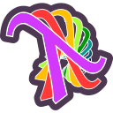

# Introduction to Recursion Schemes via JavaScript

Still work in progress

This Livebook is an introduction to the concept of recursion schemes in functional programming via Elixir.

You will learn what are Catamorphisms, Anamorphisms and Hylomorphism.
It will let you see an interesting connection structural connection between fibonacci numbers, n!, summing sequences, Mergesort, Binary-Search and more.

[Elixir Version (Livebook)][https://github.com/laszlokorte/elixir-recursion-livebook]
